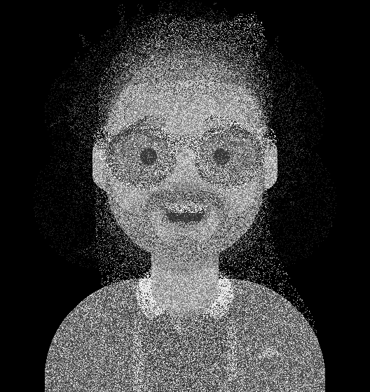
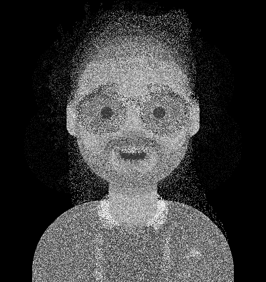
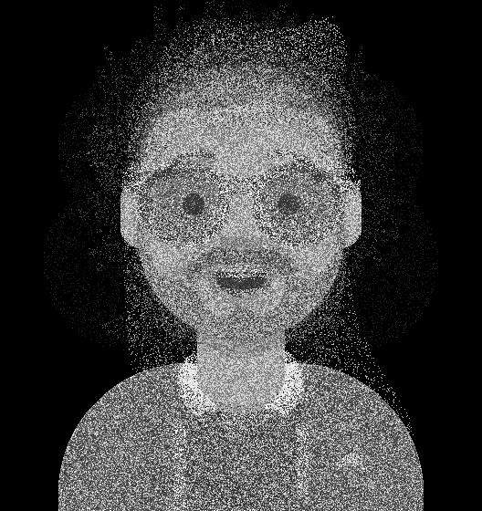

<h2 align="center">Naive bayes generator</h2>

The repo contains some of the GAN models developed as a homework of a GAN's course at ITMO University.

## Task 1
The goal of the task is to generate a set of features based on a most-common observations. 
### Dataset
The dataset contains a number of observations of types of people's clothes, accessories, haircut colors and styles.
<table>
    <tr>
        <th></th>
        <th>Нет волос</th>
        <th>Длинные в пучок</th>
        <th>Длинные волнистые</th>
        <th>Длинные прямые</th>
        <th>Короткие волнистые</th>
        <th>Короткие прямые</th>
        <th>Короткая курчавые</th>
    </tr>
    <tr>
        <td>Прическа</td>
        <td>7</td>
        <td>0</td>
        <td>1</td>
        <td>23</td>
        <td>1</td>
        <td>11</td>
        <td>7</td>
    </tr>
</table>
<table>
    <tr>
        <th></th>
        <th>Черный</th>
        <th>Блонд</th>
        <th>Каштановый</th>
        <th>Пастельный розовый</th>
        <th>Рыжий</th>
        <th>Серебристо серый</th>
    </tr>
    <tr>
        <td>Цвет волос</td>
        <td>7</td>
        <td>6</td>
        <td>2</td>
        <td>3</td>
        <td>8</td>
        <td>24</td>
    </tr>
</table>
<table>
    <tr>
        <th></th>
        <th>Нет очков</th>
        <th>Круглые очки</th>
        <th>Солнцезащитные очки</th>
    </tr>
    <tr>
        <td>Аксессуары</td>
        <td>11</td>
        <td>22</td>
        <td>17</td>
    </tr>
</table>
<table>
    <tr>
        <th></th>
        <th>Худи</th>
        <th>Комбинезон</th>
        <th>Футболка с круглым вызезом</th>
        <th>Футболка с V-вырезом</th>
    </tr>
    <tr>
        <td>Тип одежды</td>
        <td>7</td>
        <td>18</td>
        <td>19</td>
        <td>6</td>
    </tr>
</table>
<table>
    <tr>
        <th></th>
        <th>Черный</th>
        <th>Синий</th>
        <th>Серый</th>
        <th>Зеленый</th>
        <th>Оранжевый</th>
        <th>Розовый</th>
        <th>Красный</th>
        <th>Белый</th>
    </tr>
    <tr>
        <td>Цвет одежды</td>
        <td>4</td>
        <td>5</td>
        <td>6</td>
        <td>8</td>
        <td>6</td>
        <td>8</td>
        <td>7</td>
        <td>6</td>
    </tr>
</table>

### Run
The main code is available at ``task_1.py``. To run and print the generated data, simply run: 

``
python task_1.py
``

## Task 2
The goal of the task is to generate a new images based on the images from ``./task_2/images`` folder.
### Dataset

The dataset contains 11 images of drawn faces in RGB.

### Run
To run the training process and generate an image, run:

``
python task_2.py
``
A monochrome image is being generated due to the long training time.

### Generated data
Some samples of a generated data

