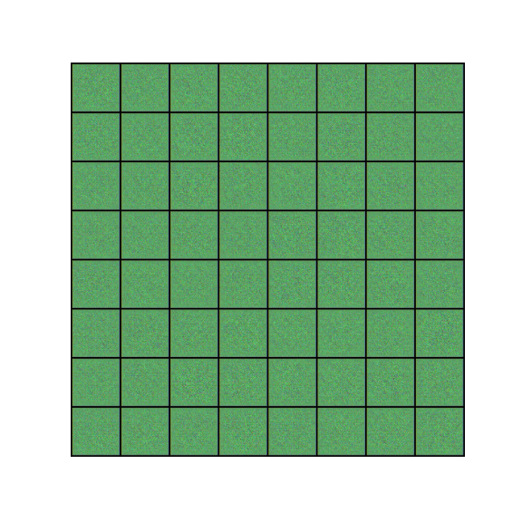
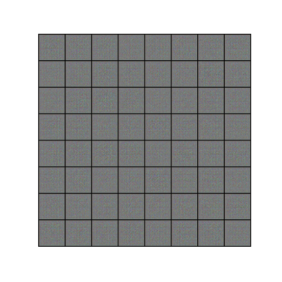
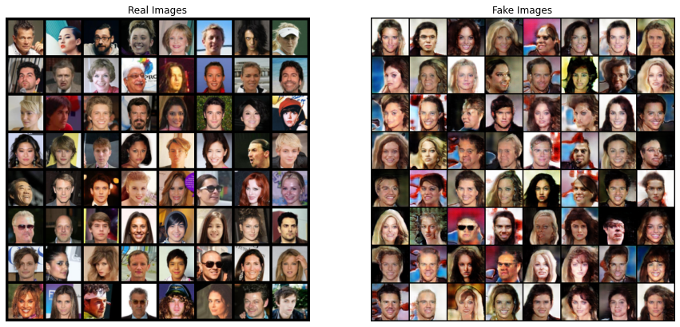
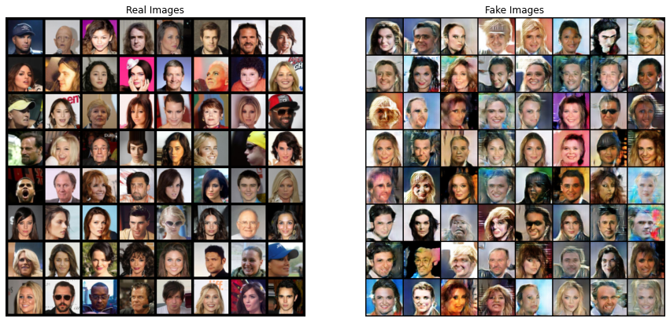

<h2 align="center">Deep Convolutional GAN</h2>

Training a DCGAN based on a Celeba dataset.

Current repository has Generators based on two implementations - on ResNet blocks and on CSP blocks.

### Train
In order to train a model make sure to download <a href="http://mmlab.ie.cuhk.edu.hk/projects/CelebA.html">CelebA</a> dataset and place `img_align_celeba.zip` into the root.

To run the training process run ``train.py`` with given parameters:

* **--data_root** - path to a root with `img_align_celeba.zip` dataset;
* **--epochs** - number of epochs to train;
* **--batch_size** - batch size;
* **--save_path** - path to a directory to save models;

``
python train.py --data_root=./data/celeba --generator=CSP --epochs=5 --batch_size=64 --save_path=./my_model
``

### Training DCGAN

Both models with CSP and ResNet blocks were trained on a full CelebA dataset for 5 epochs in Google Colab. Notebook is available at `./training.ipynb`

The metrics were logged into a TensorBoard and are available online for <a href="https://tensorboard.dev/experiment/Zp8fDOEBR9iY7WjOKWoasw">CSP GAN</a> and <a href="https://tensorboard.dev/experiment/Zp8fDOEBR9iY7WjOKWoasw">ResNet GAN</a> (image data was not uploaded, but is available at `./runs/events.out.tfevents.csp_gan` and `./runs/events.out.tfevents.resnet_gan`).

### Comparison

    
    

Training process comparison for CSP Generator (left) and ResNet Generator (right)

Original dataset and generated faces with CSP generator

Original dataset and generated faces with ResNet generator

