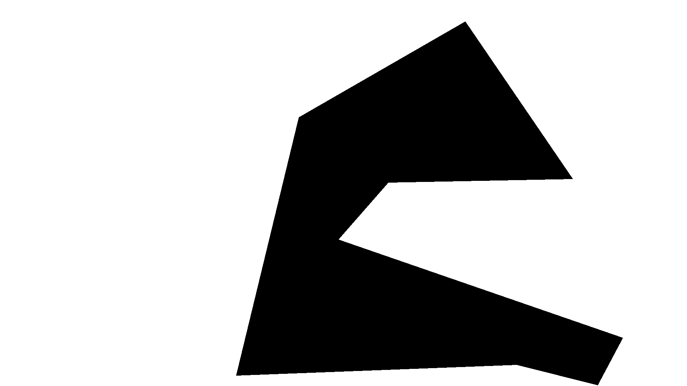

<h2 align="center">Video restoration using MAT and swapping face using SimSwap</h2>

The repo contains a source code of <a href="https://github.com/fenglinglwb/MAT">MAT</a> repository for image restoration and an implementation for video frames restoration.

### Data to restore
A video sample `masked_video.mp4` with a shaded part to restore and its mask `misc/mask.png`. 

Coordinates of a mask: [1300,60], [835,328], [660,1050], [1444,1020], [1670,1077],[1740,945], [945, 670], [1085,510], [1600, 500].

    
    

A sample of a video frame (left) and mask of an area to restore (right)

### Inference a MAT restoration
A MAT repository code was implemented as a submodule. 
In order to run the inference, run `inference.py` with given parameters:
 
* **--video_path** - path to a video to restore (`masked_video.mp4`);
* **--mask_path** - path to a mask with an area to restore (`misc/mask.png`);
* **--output_path** - path to an output video file (`output.mp4`).

``
python inference.py --video_path=masked_video.mp4 --mask_path=./misc/mask.png --output_path=./output.mp4 
``

### Swapping face with SimSwap
A <a href="https://github.com/neuralchen/SimSwap">SimSwap</a> repo was used in order to swap face.
The goal was to swap on an output of a MAT model `output_mat.mp4` with `misc/angelina.png` face.

Entire swapping process was done in the .

### Results
The result is available in the current directory `output_simswap.mp4` (please don't laugh).
